  

  
  
  

---

### Hi, I'm Ekansh

I work at the intersection of machine learning, language and systems. I'm most curious about how models actually use the information they're given: what they attend to, what they ignore, and how the structure of language shapes what they learn. Just as much, I care about the engineering that lets those models run reliably outside a notebook.

My research at LTRC, IIIT Hyderabad, sits between NLP and psycholinguistics. I work on generating narratives that balance several goals at once, on what makes some parts of a story matter more than others, on how belief and framing surface in online discourse, and on how language processing differs across languages. I lean towards interpretable approaches, where linguistic knowledge is built into the model rather than inspected after the fact.

On the ML side, I like working close to the internals: fine-tuning language models with reinforcement learning from several reward signals, building sparse Mixture-of-Experts models from scratch, and fitting models onto hardware that was never meant to run them, from a laptop GPU to a phone. My systems work, from distributed stores and file systems to kernels, comes from the same habit of understanding things well enough to build them myself.

- **Research**: NLP and psycholinguistics at the Language Technologies Research Centre (LTRC), IIIT Hyderabad
- **Studying**: B.Tech in Computer Science + MS in Computational Linguistics
- **Interested in**: interpretability, RL for language models, efficient and on-device ML, distributed systems
- **Ask me about**: narrative understanding, LLM fine-tuning, replication and consistency, OS internals

---

### Selected work

<table>
  <tr>
    <td width="50%" valign="top">
      <h4><a href="https://github.com/Ekansh0301/QuorumKV">QuorumKV</a></h4>
      Leaderless, Dynamo-style key-value store. Gossip membership over a consistent hash ring, tunable N/R/W quorums, vector clocks, hinted handoff and Merkle-tree anti-entropy keep it available through network partitions.
        <code>Python</code> <code>Redis</code> <code>Distributed Systems</code>
    </td>
    <td width="50%" valign="top">
      <h4><a href="https://github.com/Ekansh0301/Fault-Tolerant-Distributed-Storage-System">Distributed File System</a></h4>
      Concurrent DFS in C that splits metadata and data planes: a trie-indexed naming server behind an LRU cache, direct client-to-storage TCP streaming, and 3-way async replication for zero data loss on crash.
        <code>C</code> <code>POSIX Threads</code> <code>TCP/IP</code>
    </td>
  </tr>
  <tr>
    <td width="50%" valign="top">
      <h4><a href="https://github.com/Ekansh0301/Voxd">Voxd</a></h4>
      Fully offline voice assistant for Ubuntu. Whisper speech-to-text, Ollama tool calling and Piper speech synthesis share a 4GB laptop GPU, with a deterministic router that skips the LLM for frequent commands.
        <code>Python</code> <code>Ollama</code> <code>Whisper</code>
    </td>
    <td width="50%" valign="top">
      <h4><a href="https://github.com/Ekansh0301/Dropout-Squad">Multi-Critic RL for LLMs</a></h4>
      Fine-tunes Phi-2 into a Dungeon Master with PPO and 4-bit QLoRA, scored by four specialized critics with intent-conditioned reward weighting. Cuts GPU memory from 11GB to 3.5GB and beats the supervised baseline by 48.3%.
        <code>PyTorch</code> <code>PPO</code> <code>QLoRA</code>
    </td>
  </tr>
  <tr>
    <td width="50%" valign="top">
      <h4><a href="https://github.com/Ekansh0301/CryptoStack">CryptoStack</a></h4>
      Twenty cryptographic primitives on the Python standard library alone, from AES and RSA up to 2-party MPC via oblivious transfer, behind a 50-endpoint sandbox for running real attacks against each one.
        <code>Python</code> <code>FastAPI</code> <code>React</code>
    </td>
    <td width="50%" valign="top">
      <h4><a href="https://github.com/Ekansh0301/XV6-and-C-Shell">xv6 Kernel + C Shell</a></h4>
      xv6 RISC-V kernel extended with an MLFQ scheduler, lazy copy-on-write fork and user-level alarms, alongside a POSIX-style shell with pipelines, I/O redirection and signal handling.
        <code>C</code> <code>RISC-V</code> <code>Operating Systems</code>
    </td>
  </tr>
</table>

More in <a href="https://github.com/Ekansh0301/sparse-moe-summarization">sparse-moe-summarization</a> · <a href="https://github.com/Ekansh0301?tab=repositories">all repositories</a>

---

### Toolkit

  

---

  <picture>
    <source media="(prefers-color-scheme: dark)" srcset="https://raw.githubusercontent.com/Ekansh0301/Ekansh0301/output/github-snake-dark.svg">
    <source media="(prefers-color-scheme: light)" srcset="https://raw.githubusercontent.com/Ekansh0301/Ekansh0301/output/github-snake.svg">
    
  </picture>

